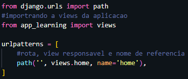

# introducao ao projeto

Todo projeto django comeca com uma pasta base instalada pelo terminal:
```md
django-admin startproject <nome_do_projeto>
```

Depois da criacao varias pastas sao criadas, porem antes de mecher vamos primeiramente `crie o aplicativo` onde ira rodar a aplicacao para o main, assim, dentro da pasta do projeto digite:
```md
django-admin startapp <app_nome>
```
Assim nesse app sera feito a conexao(rota) com o arquivo html, css ou javaScript para o site. <br>
dentro do arquivo urls.py do app voce fara a rota:



Após isso voce pode testar se esta funcionando `iniciando o servidor` no terminal:
```md
python manage.py runserver
```
ao rodar isso tambem sera criada um arquivo de banco de dados em sqlite3
